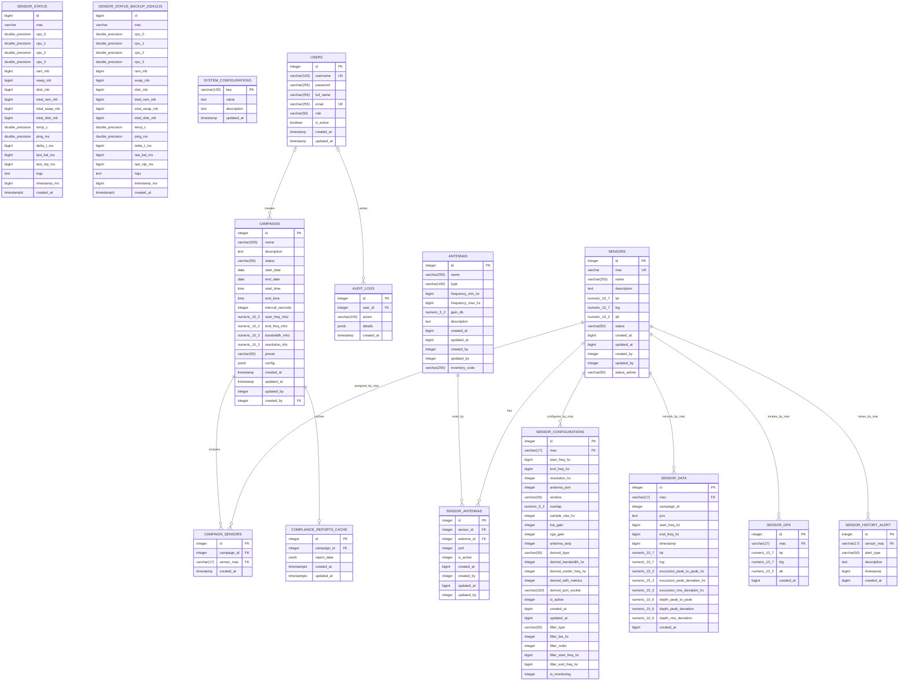
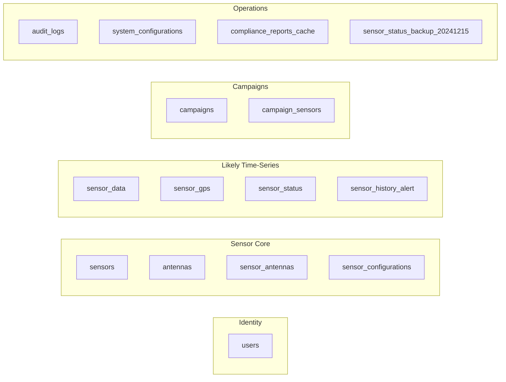

# ANE DB Starter Diagram

This diagram is built step by step from pasted `psql` output. It includes confirmed entities, the first captured columns, and relationships backed by visible constraints.

## Confirmed ERD In Progress

## Inferred Domain Grouping

## Relationship Backlog

These are still pending or intentionally absent in the captures:

| Possible relationship | Why it is suspected | Status |
| --- | --- | --- |
| `sensors` to `sensor_status` | `sensor_status` has `mac` indexes, but no FK exists in the captured constraint query | Not enforced by DB |
| `campaigns` to `sensor_data` | `sensor_data.campaign_id` exists, but no FK exists in the captured constraint query | Not enforced by DB |
| `sensor_antennas.port` to `sensor_configurations.antenna_port` | Column names suggest a relationship, but no FK appeared in `\d+ public.sensor_configurations` | Unconfirmed |
| `antennas.created_by` to `users.id` | `created_by` has an index, but no FK appeared in `\d antennas` | Unconfirmed |
| `antennas.updated_by` to `users.id` | `updated_by` has an index, but no FK appeared in `\d antennas` | Unconfirmed |
| `sensor_antennas.created_by` to `users.id` | `created_by` has an index, but no FK appeared in `\d+ public.sensor_antennas` | Unconfirmed |
| `sensor_antennas.updated_by` to `users.id` | `updated_by` has an index, but no FK appeared in `\d+ public.sensor_antennas` | Unconfirmed |
| `campaigns.updated_by` to `users.id` | `updated_by` has an index, but no FK appeared in the `\d+ public.campaigns` output | Unconfirmed |
| `sensors.created_by` to `users.id` | `created_by` has an index, but no FK appeared in the `\d+ public.sensors` output | Unconfirmed |
| `sensors.updated_by` to `users.id` | `updated_by` has an index, but no FK appeared in the `\d+ public.sensors` output | Unconfirmed |
